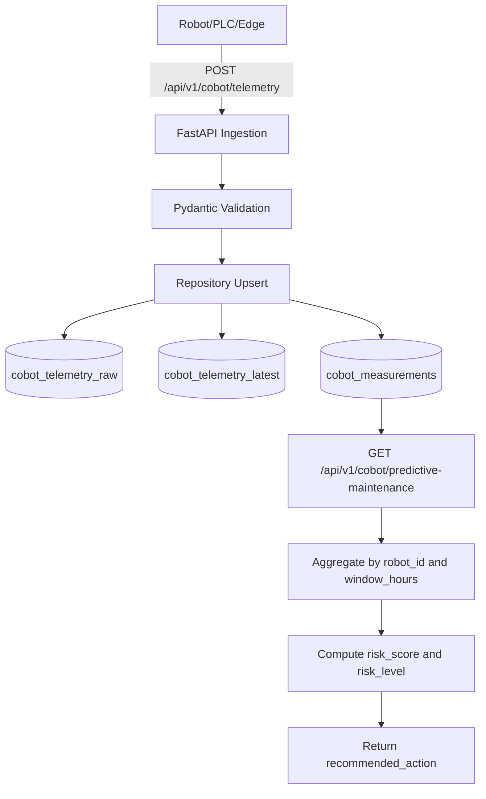

# 예지보전(Predictive Maintenance) 기능

구현된 기능은 `GET /api/v1/cobot/predictive-maintenance` 입니다.
점수 계산은 최근 `window_hours` 구간의 `cobot_measurements` 집계를 기반으로 합니다.

## 1) 예상 인풋

예지보전 결과를 조회하기 전에, 먼저 텔레메트리 수집 API로 데이터가 들어와야 합니다.

- 수집 API: `POST /api/v1/cobot/telemetry`
- 조회 API: `GET /api/v1/cobot/predictive-maintenance`

### A. 텔레메트리 수집 인풋 (예시)

```json
{
  "robot_id": "cobot-01",
  "line_id": "line-a",
  "station_id": "station-07",
  "cycle_time_ms": 1825,
  "power_watts": 438.7,
  "program_name": "door-assembly-v2",
  "status": "running",
  "good_parts": 1280,
  "reject_parts": 9,
  "temperature_c": 42.8,
  "vibration_mm_s": 1.9,
  "joint_positions_deg": [10.5, -24.0, 66.7, 12.1, 84.4, -9.3],
  "alarms": [],
  "produced_at": "2025-01-15T08:30:00Z"
}
```

### B. 예지보전 조회 인풋 (Query Parameters)

- `robot_id` (optional): 특정 로봇만 조회
- `window_hours` (optional, default `24`): 최근 N시간 기준 집계 (1 ~ 720)

예시:

```bash
curl.exe "http://localhost:8080/api/v1/cobot/predictive-maintenance?robot_id=cobot-01&window_hours=24"
```

## 2) 예상 아웃풋

`risk_score`(0~100), `risk_level`(low/medium/high), 그리고 원인 지표(온도/진동/fault 비율)를 반환합니다.

```json
{
  "window_hours": 24,
  "items": [
    {
      "robot_id": "cobot-01",
      "window_hours": 24,
      "sample_count": 12,
      "last_seen_at": "2025-01-15T08:30:00+00:00",
      "risk_score": 57.3,
      "risk_level": "medium",
      "avg_temperature_c": 42.8,
      "avg_vibration_mm_s": 1.9,
      "fault_ratio": 0.08333,
      "recommended_action": "Continue monitoring"
    }
  ],
  "notes": [
    "This endpoint implements predictive maintenance only.",
    "Risk score is a heuristic baseline and should be calibrated on real failure history."
  ]
}
```

## 3) 전체 데이터 흐름 (Flowchart TD)


