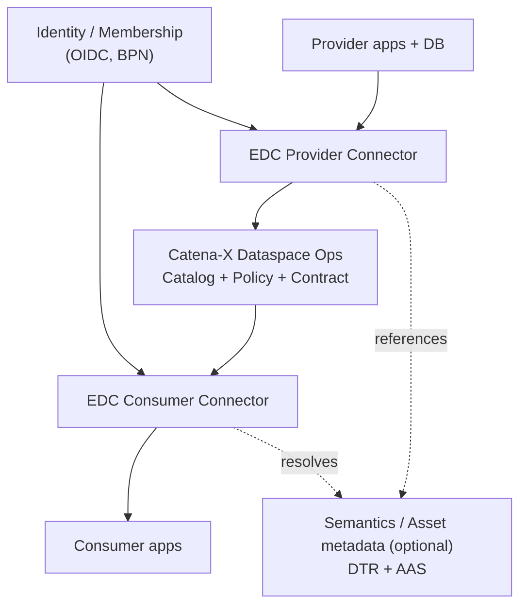
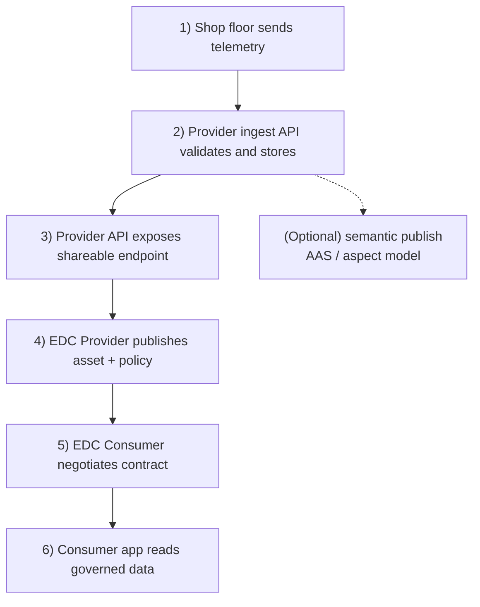
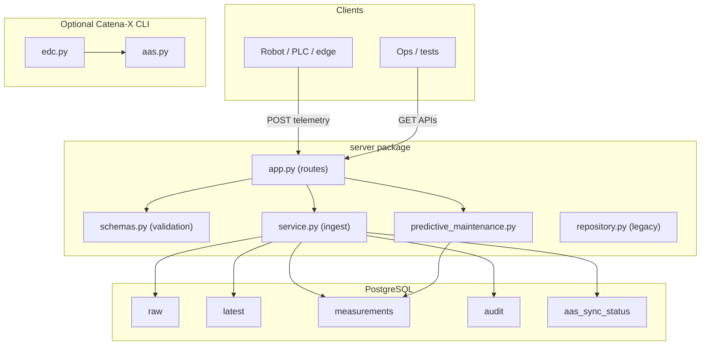

# Catena-X Cobot Telemetry Sample

This repository is a **stepping-stone sample**: a minimal **telemetry ingest + PostgreSQL + REST** service. The sections below describe the **intended end-state** for a production-grade, Catena-X–aligned deployment—not only what is wired today.

---

## Target architecture

In a full Catena-X data space, partners do **not** share raw database access.  
They exchange data through **EDC connectors** under identity, policy, and contract control.

**One-line summary:** each company keeps its own systems; connectors enforce who can access which data for what purpose.

---

## End-to-end data flow

**Design goals this implies**

- **Decouple** “fast ingest” from “governed share”: commit operational data first; publish/share via **EDC contracts** and optional **semantic** pipelines.
- **Never** expose raw DB credentials to partners; expose **contract-bound** interfaces (HTTP, streaming, etc.) through the connector.
- **Observability & audit**: correlate `request_id`, `event_id`, connector transfer logs, and policy decisions.

---

## Evolution: from this sample to production

| Area | Today (sample) | Target |
|------|------------------|--------|
| Share | Manual `edc.py` / `aas.py` CLI | **Automated** publish: outbox/worker, idempotent AAS updates, minimal synchronous coupling |
| Security | Open HTTP APIs | **AuthN/Z** (API keys, mTLS, OAuth2), rate limits, secret management |
| Data | Single Postgres | Migrations, retention, partitioning, backups |
| Ops | Basic health | Metrics, tracing, structured logging, SLOs |
| Semantics | Example submodel | **SAMM / aspect models** aligned with your use case |

---

## This repository today (what actually ships)

- **Runtime:** FastAPI (`server/app.py`) + `server/service.save_telemetry` (checksum, audit, duplicate handling, AAS sync queue row) + read APIs + heuristic **predictive maintenance** query.
- **Catena-X:** EDC/AAS are **optional** operator workflows (`edc.py`, `aas.py`); they are **not** invoked automatically on every HTTP request in the current code.

Operational steps (DB init, `uvicorn`, curls) are kept short in **[setup.txt](setup.txt)** and detailed in **[docs/CODE_MANUAL.md](docs/CODE_MANUAL.md)** / **[docs/OPERATIONS.md](docs/OPERATIONS.md)** (Korean). Predictive maintenance: **[docs/PREDICTIVE_MAINTENANCE.md](docs/PREDICTIVE_MAINTENANCE.md)**.

**Predictive maintenance note:** aggregates use `produced_at` within `window_hours`. Historical `produced_at` in sample JSON may fall outside the window and return empty `items`; omit `produced_at` to let the server stamp “now”.

---

## Appendix — sample codebase layout (as implemented)

For a file-level view of the **current** Python layout and DB tables, use this diagram when reading the code (not the long-term Catena-X figure above).

---

## Documentation

- [CODE_MANUAL.md](docs/CODE_MANUAL.md) — modules, run order, EDC/AAS CLI
- [OPERATIONS.md](docs/OPERATIONS.md) — env vars, operations, example responses
- [PREDICTIVE_MAINTENANCE.md](docs/PREDICTIVE_MAINTENANCE.md) — inputs, outputs, diagram
